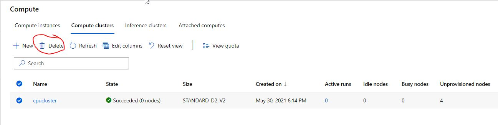

# Optimizing an ML Pipeline in Azure

## Overview
This project is part of the Udacity Azure ML Nanodegree.
In this project, we build and optimize an Azure ML pipeline using the Python SDK and a provided Scikit-learn model.
This model is then compared to an Azure AutoML run.

## Summary
This dataset contains bank marketing data. We seek to predict column 'y' of the dataset.

The best performing model was a VotingEnsemble with a 91.78% accuracy.

## Scikit-learn Pipeline
For the Scikit-learn pipeline:
- we first load the data from https://automlsamplenotebookdata.blob.core.windows.net/automl-sample-notebook-data/bankmarketing_train.csv
- then we one hot encode the data and convert to numerical data
- then we split the data by 80 / 20 into training and test sets.
- then we train a logistic regression model on the training data.
- and we use hyperdrive to choose hyperparameters.
- we then test the trained model on the test set to get an accuracy score.

The hyperparameter sampler we used is Random Sampling. The benefit of this sampler is that it is less resource intensive than the other two options but can often achieve similar quality.

The early stopping policy we chose is the Bandit Policy. The benefit of an early stopping policy is that it can stop the algorithm from wasting computation resources.  

## AutoML
The AutoML run generated a VotingEnsemble model.

## Pipeline comparison
The AutoML run generated a slightly better model with accuracy at 91.78%, while the hyperdrive run generated an accuracy of 91.21%.  
The difference in accuracy is marginal with the AutoML slightly higher.  
The model generated by AutoML is a VotingEnsemble model, while the hyperdrive run uses a hand picked logistic regression model.  
The primary reason of the difference is that AutoML was allowed to choose from a greater selection of model algorithms, and therefore had a better result.  
Although, one must note that in this case the difference is very small.

## Future work
What we could test in future experiments are:
- Allow greater range in the hyperdrive hyperparameter sampling range.
- Allow longer durations in both hyperdrive runs and AutoML runs.

The reasons are:
- There may be better hyperparameters outside of the sampling range we set.
- AutoML may have terminated early because it ran out of time.

## Proof of cluster clean up

